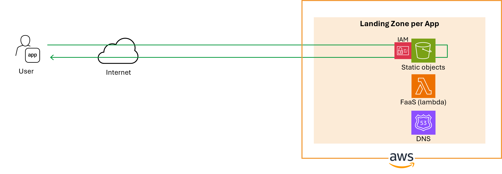
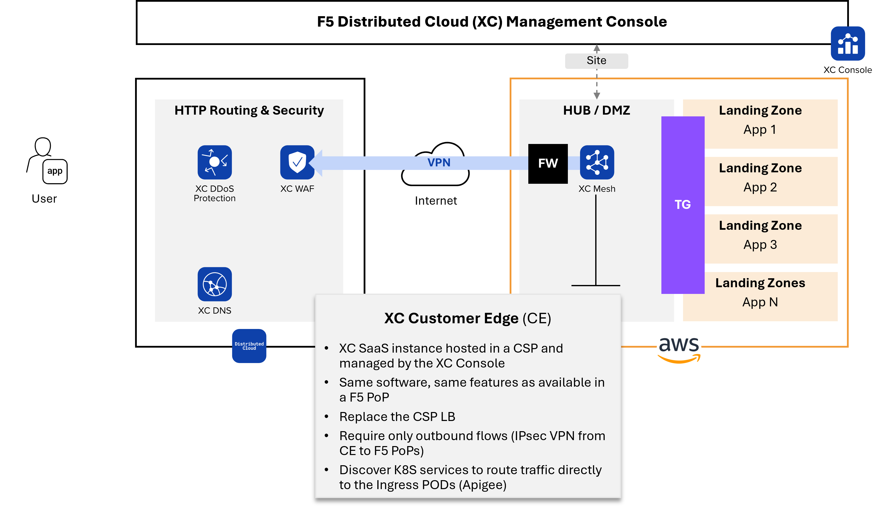

Publish a S3 based website with F5 Distributed Cloud
####################################################################

.. contents:: Contents
    :local:

Introduction
*****************************************

A S3 based web site can be published directly on Internet

... or secured by F5 Distributed Cloud (XC).
An IP filtering can be set on the S3 permission policy to allow only `F5 XC Public IPs <https://docs.cloud.f5.com/docs/how-to/site-management/create-aws-site>`_.

However, as described `here <https://www.bleepingcomputer.com/news/security/cloudflare-ddos-protections-ironically-bypassed-using-cloudflare/>`_,
the egress public IPs of a SaaS Edge solution are shared, therefore there is a security risk of unauthorized access from
another SaaS Edge customer, bypassing your security control.

The solutions to mitigate the risk:

    1. Share a common Secret between SaaS Edge and the customer gateway. This secret could be in an HTTP header. It requires added resources (AWS/Azure WAF) to be subscribed and configured by the App Landing Zone.
    2. Enable mTLS on both SaaS Edge and the customer gateway. mTLS is not supported on AWS CloudFront and Azure FrontDoor.
    3. Deploy a F5 XC connector (Customer Edge) in the customer environment and access to App resources published internally.

This article is describing the solution #3,
especially how to limit a S3 bucket access to an internal F5 XC Customer Edge (CE).

1. Deploy a XC connector / Customer Edge
*****************************************

You can deploy a secure private link - a XC VPN link - from your Public Cloud subscription to F5 XC Global Network.

The XC VPN link can be deployed only in XC UI (or Terraform/API), with no action on the Cloud Service Provider console.
XC will deploy a cluster of XC VMs in your subscription.

After booting, these VMs will automatically initiate 2 IPsec VPN connection to F5 XC.
Now, all traffic from F5 XC can directly communicate with your App's private resources... if allowed.

2. Limit the access on your S3 bucket
*****************************************

a) S3 listener
=========================================
Add the S3 service to listen in the XC CE inside subnet, named a Service Endpoint
So, the CE will be able to connect to your S3 services exposed internally.

b) Allow the CE to consume your S3 bucket
========================================
In the permission policy of the S3 bucket, allow the CE to access to the desired objects,
by allowing the Service Endpoint as the source.

.. code-block:: json

    {
        "Version": "2012-10-17",
        "Statement": [
            {
                "Sid": "AllowInternalAccessViaVpcEndpoint",
                "Effect": "Allow",
                "Principal": "*",
                "Action": [
                    "s3:GetObject",
                    "s3:GetObjectVersion"
                ],
                "Resource": [
                    "arn:aws:s3:::alexis-demo-s3-origin",
                    "arn:aws:s3:::alexis-demo-s3-origin/*"
                ],
                "Condition": {
                    "StringEquals": {
                        "aws:SourceVpce": "vpce-0d1088281335a8866"
                    }
                }
            }
        ]
    }

3. Redirect /static PATH to your S3 bucket
*********************************************
You might want to redirect the static resources of your web site, under the ``/static`` PATH, to the S3 bucket.
In the published App configuration in XC, create a ``route`` for ``/static`` PATH

- the target of this route is your S3 bucket

- and remove the /static PATH before sending the request to the S3 bucket

